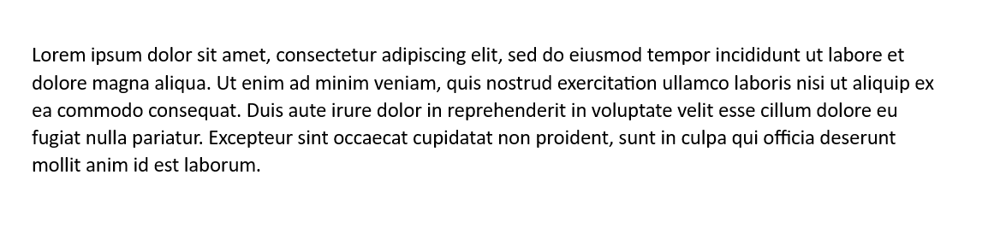
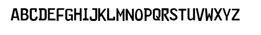
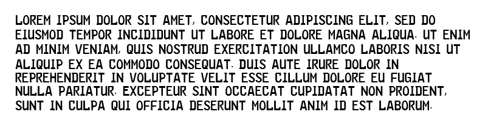
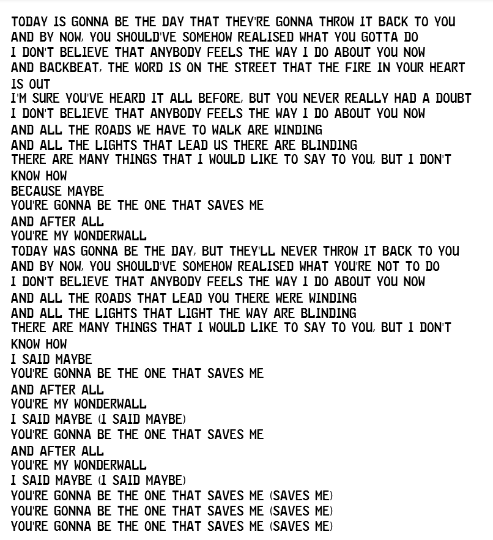
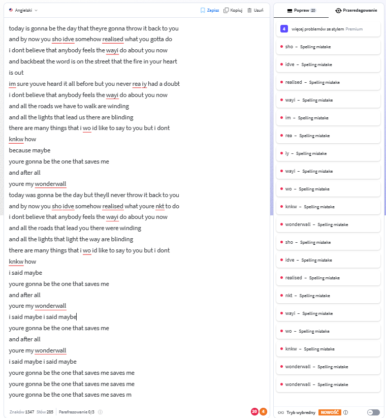

<font size="6">
OPTICAL CHARACTER RECOGNITION
</font>

<br>

OCR is the process of converting images of text into machine-encoded text. 

For example we have the following image:


We want our program to recognize the text in the image and output it as a string:
```
Lorem ipsum dolor sit amet, consectetur adipiscing elit, ...
```

These are the steps I followed to create a program that recognizes text in the image:
<ol>
<li>Create alphabet</li>
<li>Invert and grayscale image</li>
<li>For each letter in alphabet: 
<ol><li>Calculate correlation between image and letter using DFT, IDFT and the formula: C=real(ifft2(fft2(galia).*fft2(rot90(imp,2),h,w)));</li>
<li>Add letter to output string</li></ol></li>
<li>Take output string and print it out with added spaces and nextlines.</li>
</ol>


<br>

__1. Creating alphabet:__

Some letters in alphabet are easier to recognize than others also some letters overlap with others. For example letter "e" and "c" are very similar and can be hard to distinguish.

So keeping that in mind we will have to pick font that has letters that are easy to recognize and don't overlap with others.

We will use the following font:


Also we will set different percentages of correlation per letter:
```python
percentege_per_letter = {'a': 0.90, 'b': 0.90, 'c': 0.90, 'd': 0.92,
                            'e': 0.90, 'f': 0.95, 'g': 0.90, 'h': 0.95,
                            'i': 0.90, 'j': 0.90, 'k': 0.90, 'l': 0.90,
                            'm': 0.92, 'n': 0.92, 'o': 0.90, 'p': 0.90,
                            'q': 0.90, 'r': 0.90, 's': 0.90, 't': 0.93, 
                            'u': 0.90, 'v': 0.90, 'w': 0.90, 'x': 0.90,
                            'y': 0.90, 'z': 0.90}
```
This should be adjusted depending on the quality of the image and the font used.


In addition we will seperate creating alphabet in 4 parts:
```python
easy_to_read_short = {}
easy_to_read_long = {}
medium_to_read = {}
hard_to_read = {}
```

Each alphabet will be stored in a dictionary with the letter as a key and the inverted and grayscaled image as a value.

This condition will help us set lower percentege for letters that are harder to recognize. Because we will firstly add letters that are easier to recognize to the output string and while adding letters we will check if the place where we are adding the letter is already taken. If it is we will skip that letter and move to the next one.


Function that creates alphabet:
```python
def create_alphabet(alphabet_path):
    easy_to_read_short = {}
    easy_to_read_long = {}
    medium_to_read = {}
    hard_to_read = {}


    for letter_filename in os.listdir(alphabet_path):
        letter = letter_filename.split('.')[0]
        letter_img = Image.open(os.path.join(alphabet_path, letter_filename))
        letter_img_inv = invert_image(letter_img)
        letter_img_gray = to_gray(letter_img_inv)

        
        if letter in ['a','b','d','e','f','k','n','s','t','x','z']:
            easy_to_read_short[letter] = letter_img_gray
            
        elif letter in ['g','j','p','q','y']:
            easy_to_read_long[letter] = letter_img_gray

        elif letter in ['m','o','r','w','h']:
            medium_to_read[letter] = letter_img_gray

        else:
            hard_to_read[letter] = letter_img_gray
        
    
    return easy_to_read_short,easy_to_read_long,medium_to_read,hard_to_read
```


__2. Calculating correlation between image and letter and adding letter to string:__

Functions to help add letter to string:
```python
def find_elements(correlation,letter):
    elements = []
    w,h = correlation.shape

    for i in range(w):
        for j in range(h):
            if correlation[i,j] > percentege_per_letter[letter]:
                elements.append((i,j))
    
    return elements

def line_already_exists(y,lines):
    for line in lines:
        if abs(line - y) < 3:
            return line
    return 0
    

def space_taken(text,given_letter):

    for letter in text:
        if abs(letter[1][0] - given_letter[1][0]) < 7 and abs(letter[1][1] - given_letter[1][1]) < 7:
            return True
    return False
```


Function that adds letter to string:
```python
def add_letter(correlation,letter,text,lines):

    elements = find_elements(correlation,letter)


    for y,x in elements:
        line = line_already_exists(y,lines)
        if not line:
            lines.append(y)
        else:
            y = line
        
        if not space_taken(text,(letter,(x,y))):
            text.append((letter,(x,y)))
            
  
    return text
```


Calculating correlation between image and letter without normalization:
```python
def correlation_wout_norm(A_gray,letter_gray):
    highest_correlation = calculate_correlation(letter_gray, letter_gray,False)
    correlation = calculate_correlation(A_gray, letter_gray,False)
    correlation /= np.max(np.abs(highest_correlation))

    return correlation
```
Function that for each letter in alphabet calculates correlation between image and letter and adds letter to string:
```python

for letter in easy_to_read_short:    
    correlation = correlation_wout_norm(A_gray,easy_to_read_short[letter])
    add_letter(correlation,letter,text,lines)
    
for letter in easy_to_read_long:
    correlation = correlation_wout_norm(A_gray,easy_to_read_long[letter])
    add_letter(correlation,letter,text,lines)

...

```

__3. Adjusting text:__
```python
def adjust_text(text,lines):
    text.sort(key=lambda x: (x[1][1],x[1][0]))

    for i in range(len(text)-1):
        print(text[i][0],end='')
        if text[i+1][1][1] != text[i][1][1]:
            print('\n',end='')
        elif abs(text[i+1][1][0] - text[i][1][0]) > 18:
            print(' ',end='')
```

__4. Putting it all together:__
```python
def image_to_text(image_path,alphabet_path):

    easy_to_read_short,easy_to_read_long,medium_to_read,hard_to_read = create_alphabet(alphabet_path)

    A = Image.open(image_path)
    A_inv = invert_image(A)
    A_gray = to_gray(A_inv)

    text = []
    lines = []


    for letter in easy_to_read_short:    
        correlation = correlation_wout_norm(A_gray,easy_to_read_short[letter])
        add_letter(correlation,letter,text,lines)
        
    for letter in easy_to_read_long:
        correlation = correlation_wout_norm(A_gray,easy_to_read_long[letter])
        add_letter(correlation,letter,text,lines)

    for letter in medium_to_read:
        correlation = correlation_wout_norm(A_gray,medium_to_read[letter])
        add_letter(correlation,letter,text,lines)

    for letter in hard_to_read:
        correlation = correlation_wout_norm(A_gray,hard_to_read[letter])
        add_letter(correlation,letter,text,lines)


    adjust_text(text,lines)
        
```

Let's test the program with the following image:


```python
image_to_text('images/FE/FE2.png','images/FE/characters')
```

Output:
```
lorem ipsum dolor sit amet consectetur adipiscing elit sed do
eiusmod temporincididunt ut labore et dolore magna aiijua ut enim
ad minim veniam juis nkstrud exercitation ullamco laboris nisi ut
alijuip ex ea commodo consejuat duis aute irure dolorin
reprehenderitin voluptate veiit esse ciilum dolore eu fugiat
nulia pariatur excepteur sint occaecat cupidatat non proident
suntin cuipa jui officia deserunt moliit anim id est laboru
```

Let's test try different image and check the output in LanguageTool:


Output:
```
today is gonna be the day that theyre gonna throw it back to you
and by now you sho idve somehow realised what you gotta do
i dont believe that anybody feels the wayi do about you now
and backbeat the word is on the street that the fire in your heart
is out
im sure youve heard it all before but you never rea iy had a doubt
i dont believe that anybody feels the wayi do about you now
and all the roads we have to walk are winding
and all the lights that lead us there are blinding
there are many things that i wo id like to say to you but i dont
knkw how
because maybe
youre gonna be the one that saves me
and after all
youre my wonderwall
today was gonna be the day but theyll never throw it back to you
and by now you sho idve somehow realised what youre nkt to do
i dont believe that anybody feels the wayi do about you now
and all the roads that lead you there were winding
and all the lights that light the way are blinding
there are many things that i wo id like to say to you but i dont
knkw how
i said maybe
youre gonna be the one that saves me
and after all
youre my wonderwall
i said maybe i said maybe
youre gonna be the one that saves me
and after all
youre my wonderwall
i said maybe i said maybe
youre gonna be the one that saves me saves me
youre gonna be the one that saves me saves me
youre gonna be the one that saves me saves m
```


We only got 20 spelling mistakes. Rest of the mistakes are grammar or style suggestion which is not our concern.

Our program got 20 mistakes on 285 words. That is accuracy of 93%. __I'd call that a success.__

This is a very simple OCR program that can be improved in many ways. For example we can use neural networks to recognize letters or we can use different algorithms to calculate correlation between image and letter. We can also use different techniques to normalize the image and the letter before calculating the correlation.
